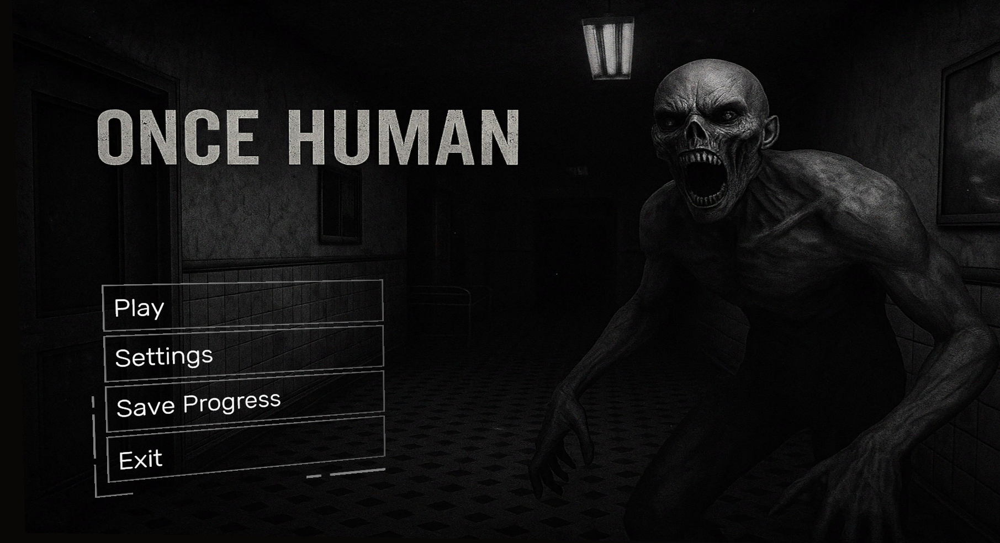
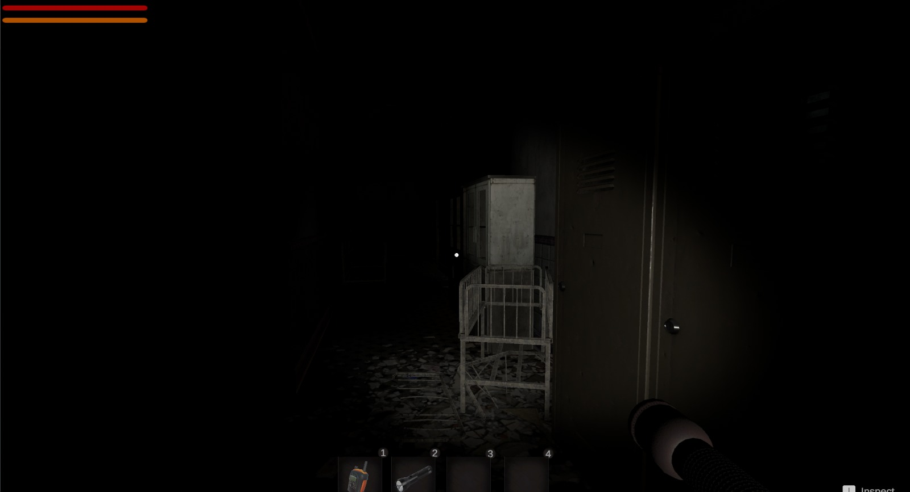
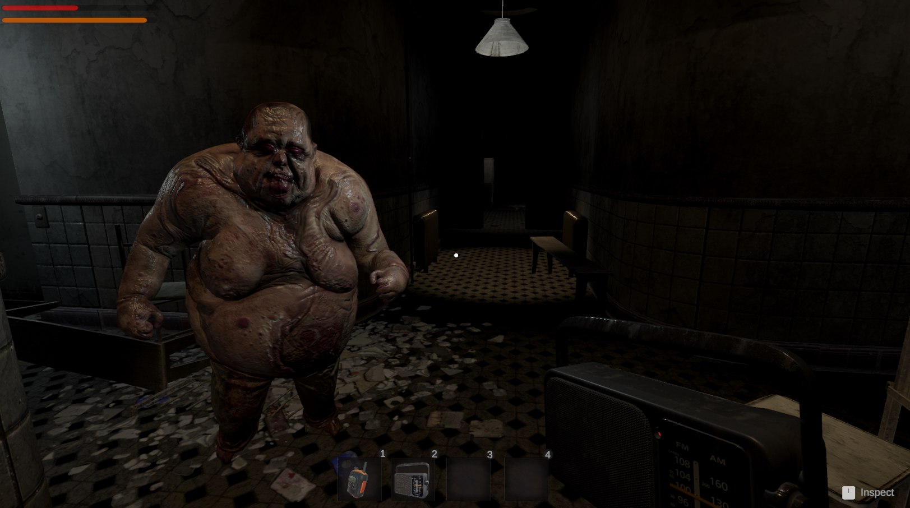
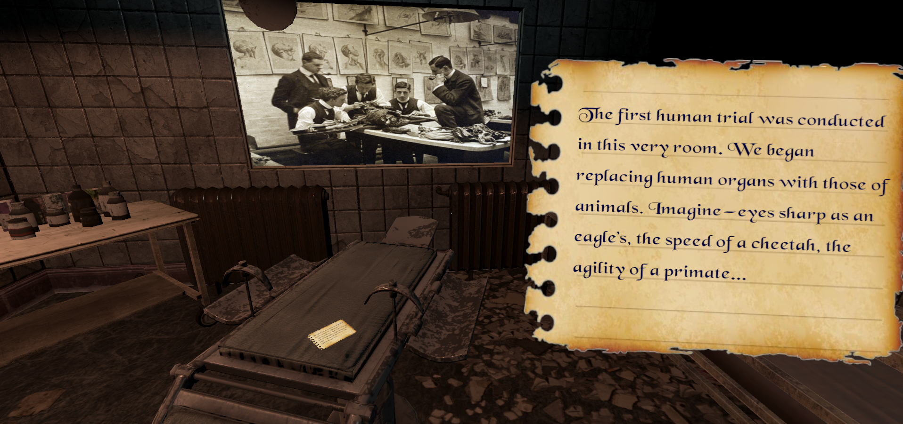
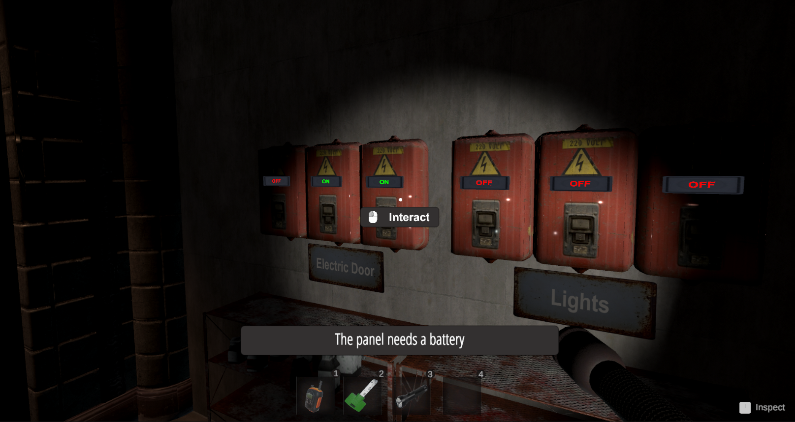
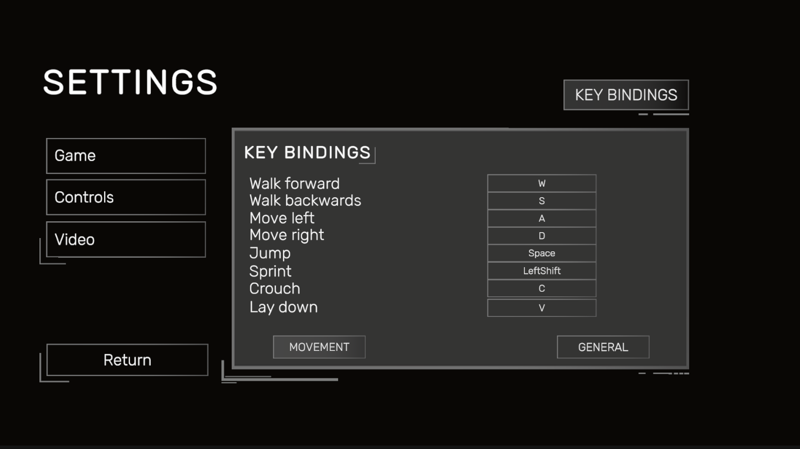

# Once Human 👁️

**Once Human** is a first-person horror exploration game set in an abandoned hospital where gruesome experiments were performed.  
Your mission is to return critical documents proving what happened — if you can survive the horrors inside.

---

## 🔹 Features
 

- Atmospheric hospital setting with dark ambient lighting
 
- Creepy monsters that hunt you
 
- Jumpscares and unsettling lore

- Key collection, map navigation, and limited resources

---

## 🔧 Controls  
*All keybindings are fully customizable in-game via the settings menu.*

| 🎮 **Movement**           | ⚙️ **General / Actions**              |
|--------------------------|---------------------------------------|
| **W** – Walk forward      | **Esc** – Pause                      |
| **S** – Walk backward     | **M** – Toggle map                   |
| **A** – Move left         | **E** – Toggle flashlight            |
| **D** – Move right        | **Left Click** – Interact            |
| **Space** – Jump          | **Right Click** – Drop item          |
| **Left Shift** – Sprint   | **Hold Left Click** – Use item       |
| **C** – Crouch            |                                       |
| **V** – Lay down          |                                       |

---
🎮 Play on Itch.io: [https://alexdanciu.itch.io/once-human](https://alexdanciu.itch.io/once-human)
📥 Or [download the game directly from GitHub](https://github.com/DanciuAlexTeodor/Once-Human) — scroll up to the top and download the `.zip` or `.exe` from the file list above. 

## 🖥️ How to Play
1. Download the release from the `Releases` section
2. Extract the `.zip` file
3. Run `Once Human.exe`

> Make sure the `Once Human_Data/` folder is in the same directory as the `.exe`!

---
 

## 📚 Deep Dive: Behind the Code  
🔍 Want to see how it all works?  
👉 [**Explore the Full Technical Overview** →](TECHNICAL_OVERVIEW.md)
  

## ✨ Optimization & Performance
This project was developed with a strong focus on:

- 🖼️ **High-quality graphics**: Detailed textures and atmospheric lighting to deliver immersive horror visuals.
- ⚡ **Fast interactions**: Seamless UI and responsive gameplay to keep the experience fluid and intense.
- 💾 **Lightweight build**:  
  - Just **~100 MB** in compressed `.zip` format  
  - Only **~150 MB** on disk after extraction — optimized for quick downloads and low storage impact.

> ✅ *Ideal for players who want high visual fidelity **without sacrificing performance or storage.***
`

 

## 📬 Feedback & Bugs
Feel free to open issues or contact me if you find bugs or have suggestions!
📧 Email: [danciualex15@yahoo.com](mailto:danciualex15@yahoo.com)
💬 Discord: alexxdt2004

  

## 🚧 Development Status

⚠️ This game is currently **in development**. The version available now includes **only the first scene**.

The final release will consist of **three scenes**:

1. **Scene 1 – The Evidence** *(In development)*  
   - Explore the hospital and recover key documents that hint at disturbing experiments.

2. **Scene 2 – The Ventilation System** *(Planned)*  
   - Navigate the tight, claustrophobic ventilation network to evade danger and discover hidden chambers.
3. **Scene 3 – The Doctor's Wing** *(Planned)*  
   - Uncover the other side of the hospital, where you’ll finally learn the truth about the doctor’s identity, his past, and what drove him to commit such horrific acts.

Stay tuned for future updates, and feel free to leave feedback or bug reports to help improve the project!
